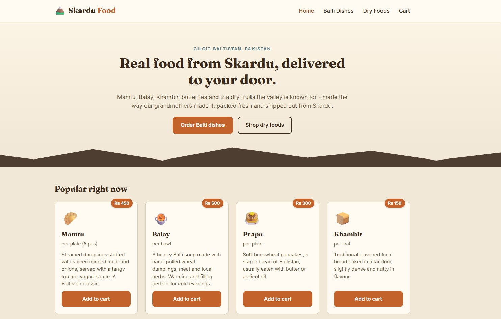

# Skardu Food

Just trying to explore and showcase the variety of desi dishes and dry foods
available in Gilgit-Baltistan, and let people order them online.

This is a full-stack project:
- **frontend/** - React (Vite) site, customer facing + a small admin panel
- **backend/** - Node.js + Express API, data is stored in plain JSON files (no database needed)

## Features

- Browse Balti dishes (Mamtu, Balay, Khambir, Chapshoro, etc.)
- Browse dry foods (dried apricots, walnuts, mulberries, apricot oil)
- Add to cart, change quantity, remove items (cart is saved in the browser)
- Checkout with name/phone/address - cash on delivery, no payment gateway
- Admin panel to view orders, update order status, and add/edit/delete products
- Fully responsive (tested down to mobile widths)

## Running it locally

You need Node.js installed (v18+ is fine).

### 1. Backend

```bash
cd backend
npm install
cp .env.example .env
npm start
```

This starts the API on `http://localhost:5000`. The default admin password
is set in `.env` (`ADMIN_PASSWORD`) - change it before you actually deploy
this anywhere.

### 2. Frontend

In a second terminal:

```bash
cd frontend
npm install
cp .env.example .env
npm run dev
```

This starts the site on `http://localhost:5173`. It talks to the backend
using the URL in `frontend/.env` (`VITE_API_URL`).

### 3. Using the admin panel

Go to `/admin/login` on the site (there's also a small "Admin" link in the
footer) and log in with whatever you set `ADMIN_PASSWORD` to.

## Notes / things to know

- Products and orders are stored in `backend/data/products.json` and
  `backend/data/orders.json`. There's no real database, so don't run this
  on something like Vercel/serverless where the filesystem resets - a
  normal VPS or `npm start` on your own machine works fine.
- The admin login is intentionally simple (just a password check against
  one value in `.env`), it's not meant to be production-grade auth.
- There's no real payment integration, checkout just collects the order
  details for cash-on-delivery / phone confirmation.

## Folder structure

```
skardu-food/
├── backend/
│   ├── data/            products.json + orders.json
│   ├── routes/          products, orders, admin
│   ├── middleware/      adminAuth
│   ├── utils/           storage.js (read/write json helpers)
│   └── server.js
└── frontend/
    └── src/
        ├── components/  Navbar, Footer, ProductCard
        ├── context/      CartContext
        ├── pages/        Home, Menu, DryFoods, Cart, Checkout, AdminLogin, AdminDashboard
        ├── api.js
        └── index.css
```
